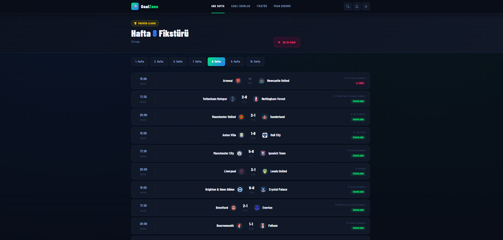

<div align="center">

# ⚽ GoalZone

### Premier Lig Soccer API Projesi

[](https://dotnet.microsoft.com/)
[](https://dotnet.microsoft.com/apps/aspnet)
[](https://learn.microsoft.com/ef/core/)
[](https://www.microsoft.com/sql-server)
[](https://getbootstrap.com/)

İngiltere Premier Lig'ine ait **20 takımlı** bir yapıyı kapsayan; skor, sonuç, puan durumu ve fikstür bilgilerini yöneten katmanlı mimaride bir API ve web projesi.

</div>

---

## 📋 İçindekiler

- [Genel Bakış](#-genel-bakış)
- [Mimari](#️-mimari)
- [Entity'ler](#-entityler)
- [Sayfalar](#-sayfalar)
- [Admin Panel](#-admin-panel)
- [Ekran Görüntüleri](#-ekran-görüntüleri)
- [Kurulum](#-kurulum)
- [Teknolojiler](#-teknolojiler)

---

## 🎯 Genel Bakış

Puan durumu için ayrı bir tablo tutulmaz — maç sonuçlarından **dinamik olarak** hesaplanır:

| Sonuç | Puan |
|:---:|:---:|
| 🟢 Galibiyet | 3 |
| 🟡 Beraberlik | 1 |
| 🔴 Mağlubiyet | 0 |

---

## 🏗️ Mimari

Proje **6 katmandan** oluşur; entity'ler API'den doğrudan dönülmez, her zaman DTO'ya map'lenir.

```
GoalZone
│
├── 🧩 GoalZone.EntityLayer         → Entity'ler ve enum'lar
├── 📦 GoalZone.DtoLayer            → API'nin dışa açtığı DTO'lar
├── 🗄️ GoalZone.DataAccessLayer     → EF Core, Repository deseni, Context, Migrations
├── ⚙️ GoalZone.BusinessLayer       → Servisler (Manager) ve AutoMapper profilleri
├── 🌐 GoalZone.WebApi              → REST API (Controller'lar)
└── 🖥️ GoalZone.WebUI               → MVC arayüz (Public Site + Admin Panel)
```

---

## 🗂 Entity'ler

| Entity | Açıklama |
|---|---|
| 🏟️ `Team` | Takım bilgileri, `Stadium` ile ilişkili |
| 🏛️ `Stadium` | Stadyum bilgileri (isim, şehir, kapasite) |
| 🏃 `Player` | Oyuncu bilgileri, `Team` ile ilişkili |
| ⚽ `FootballMatch` | Ev sahibi, deplasman, ilk yarı/maç sonu skoru, stadyum, tarih/saat, görsel, maç durumu |
| 🎯 `MatchEvent` | Maç olayı: oyuncu ismi, dakika, olay türü (`EventType` enum) |
| 📊 `MatchStatistic` | Maç istatistiği: istatistik adı, ev sahibi/deplasman değeri |
| 📰 `News` | Haber modülü |

**MatchStatus enum:** `NotStarted` 🔵 Henüz Oynanmadı → `Live` 🔴 Devam Ediyor → `Finished` 🟢 Tamamlandı

> **Not:** Maç olaylarındaki oyuncu bilgisi (gol detayları) anonim isimlerle, `Player` tablosuna zorunlu bağımlılık olmadan girilir.

---

## 📄 Sayfalar

### 🏠 Ana Sayfa
En son haftaya ait maç sonuçları listelenir. Maçlar canlı / tamamlanan / yaklaşan olarak ayrılıp gösterilir.

### 📅 Fikstür
Hafta bazlı gezinme sağlanır. Kullanıcı hangi haftayı seçerse (geçmiş haftalar dahil) o haftaya ait maçlar listelenir.

### 🏆 Puan Durumu
Ayrı bir tablo tutulmadan `FootballMatch` verisinden anlık hesaplanır:
- Atılan gol (toplam) · Yenilen gol (toplam) · Averaj (gol farkı) · Toplam puan · Son 5 maç formu (G-B-M)

### 🔍 Maç Detayı
Bir maça tıklandığında:
- **Maç Olayları** — oyuncu ismi, dakika, olay türü (Gol / Sarı Kart / Kırmızı Kart / Oyuncu Değişikliği)
- **Maç İstatistikleri** — manuel girilen veriler

---

## 🔐 Admin Panel

Sistemin yönetildiği panelden takım, stadyum ve oyuncu kayıtları oluşturulup düzenlenebilir. Maç, maç olayı ve maç istatistiği gibi ligin işleyişine dair veriler de yine bu panel üzerinden sisteme kazandırılır:

- ➕ Maç ekleme
- ➕ Maç olayı ekleme (gol, kart, oyuncu değişikliği)
- ➕ Maç istatistiği ekleme

---

## 🖼 Ekran Görüntüleri

<details open>
<summary><b>🌐 Public Site</b></summary>
<br>

**Ana Sayfa**


**Fikstür**


**Fikstür Listesi**


**Puan Durumu**


**Maç Detay**


**Haber Listesi**


</details>

<details open>
<summary><b>🔐 Admin Panel</b></summary>
<br>

**Admin Dashboard**


**Maç Listesi**


**Maç Ekleme Sayfası**


**Maç Olayları**


**Maç Olayı Ekle**


**Maç İstatistiği Ekleme**


**Takım Listesi**


**Oyuncu Listesi**


**Stadyum Listesi**


</details>

## 🚀 Kurulum

**1.** Repoyu klonlayın:
```bash
git clone https://github.com/kullanici-adi/GoalZone.git
```

**2.** `GoalZone.WebApi/appsettings.json` içindeki connection string'i düzenleyin:
```json
"ConnectionStrings": {
  "DefaultConnection": "Server=YOUR_SERVER;Database=GoalZoneDB;Trusted_Connection=True;TrustServerCertificate=True;"
}
```

**3.** Migration'ları uygulayın:
```bash
cd GoalZone.WebApi
dotnet ef database update
```

**4.** Önce API'yi, ardından WebUI'yi çalıştırın:
```bash
dotnet run --project GoalZone.WebApi
dotnet run --project GoalZone.WebUI
```

**5.** Admin Panel üzerinden takım, stadyum, oyuncu, maç, maç olayı ve maç istatistiği verilerini girin.

> API her zaman WebUI'den **önce** ayakta olmalıdır.

---

## 🛠 Teknolojiler

<div align="left">

| Katman | Teknoloji |
|---|---|
| Backend | ASP.NET Core Web API |
| ORM | Entity Framework Core |
| Veritabanı | SQL Server |
| Mapping | AutoMapper |
| Frontend | ASP.NET Core MVC, Razor, ViewComponents |
| Stil | Bootstrap 5, Bootstrap Icons |
| Veri Formatı | JSON (Newtonsoft.Json) |
| Dokümantasyon | Swagger / Swashbuckle |

</div>

---

<div align="center">

**GoalZone** — Premier Lig verilerini yönetmenin pratik yolu ⚽

</div>
